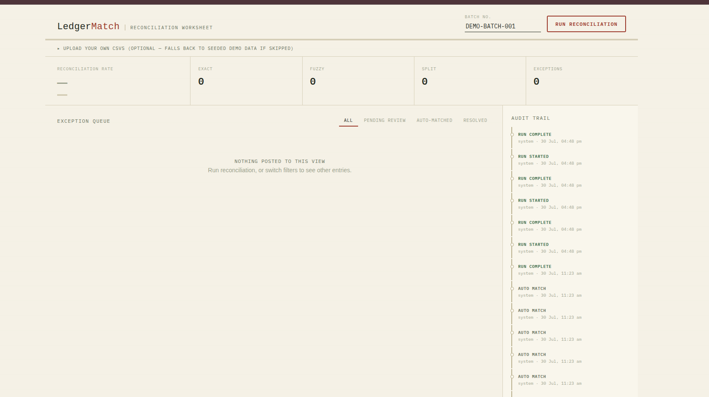
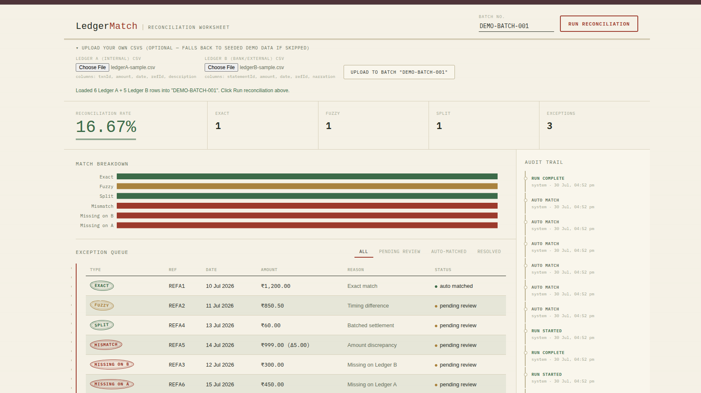
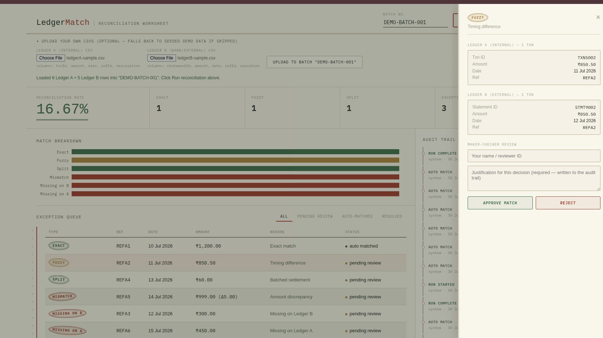
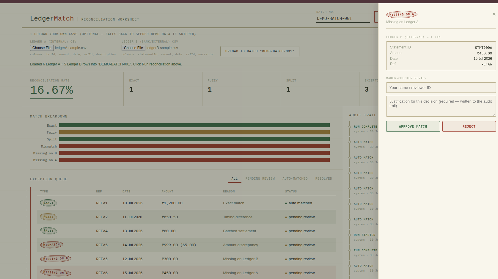

# LedgerMatch — A Bank Ledger Reconciliation Engine

A full-stack MERN project that automatically checks if two sets of transaction records match — like comparing your own order records with your bank statement — and flags anything that doesn't add up.

## Why I built this

I wanted to build something closer to what a real fintech or banking team actually works on.

Here's the problem: every bank and payment company keeps two records of the same transaction. Your app might say "order refunded," but the bank statement should show that money actually coming back. In practice, these two records rarely match up perfectly. Timing can be different, a fee might get deducted along the way, or one side simply never records the transaction at all. Someone, or something, has to go through and match these records up, and flag the ones that don't look right.

RBI actually has a rule about this. Banks are required to reverse a failed transaction within a set number of days — T+1 for UPI/IMPS, and 5 days for ATM transactions — or pay the customer ₹100 per day as a penalty. That rule exists because this exact reconciliation gap is such a common, real problem in the industry. This project is a smaller version of the kind of system that would catch that gap early, before it turns into a customer complaint or a compliance issue.




## Features

- **Two-sided ledger matching** — upload or load two sets of transactions (your internal records and the bank's records) and let the engine compare them
- **Four-tier matching logic**
  1. **Exact match** — same amount, same date, same reference ID
  2. **Fuzzy match** — same amount, but the date is off by a day or two (common when settlement gets delayed)
  3. **Split match** — one bank transaction that's actually the sum of two smaller internal transactions (happens with batched payouts)
  4. **Amount mismatch** — same transaction, but the amount is slightly different, usually because a fee was deducted
- **Exception queue** — anything the system can't confidently match gets flagged for manual review instead of being silently ignored
- **Maker-checker review** — approving or rejecting a flagged transaction requires typing a reason first. This is a real control banks use so no one can quietly change a record without explaining why
- **Permanent audit trail** — every match and every manual decision gets logged and nothing is ever deleted or overwritten, so the full history is always visible
- **Safe re-runs** — running the matching process again on the same batch doesn't create duplicate entries
- **CSV upload** — bring your own transaction data instead of relying only on demo data, with basic validation for missing columns or bad values
- **Sample/demo data included** — a seed script generates a realistic batch of transactions with built-in mismatches, so the project works out of the box even without real data







## Tech stack

- **MongoDB** — stores both ledgers, the matches, and the audit log
- **Express + Node** — backend API and the actual matching logic
- **React (Vite)** — dashboard where you can see match results and review exceptions
- **Multer + csv-parse** — handles CSV file uploads on the backend

## Project structure

```
ledgermatch/
├── client/                      # React frontend (Vite)
│   └── src/
│       ├── components/          # StatBar, LedgerTable, MatchDrawer, AuditTrail, etc.
│       ├── services/api.js      # all API calls to the backend
│       ├── utils/format.js      # date/amount formatting helpers
│       └── App.jsx              # main app, ties everything together
│
├── server/                      # Express backend
│   ├── models/                  # LedgerA, LedgerB, Match, AuditLog (Mongoose schemas)
│   ├── routes/                  # reconciliation.js, upload.js
│   ├── services/
│   │   └── matchingEngine.js    # the core matching logic — this is the main file
│   ├── scripts/seed.js          # generates sample transaction data
│   └── index.js                 # server entry point
│
└── sample-data/                 # example CSVs for the upload feature
```

## How to run it

You need MongoDB running somewhere (either install it locally, or make a free account on MongoDB Atlas — that's what I used).

**1. Start the backend**
```bash
cd server
cp .env.example .env
# open .env and put your own MongoDB connection string in there
npm install
npm run seed      # generates sample transaction data so you can try it right away
npm run dev
```

**2. Start the frontend** (in a new terminal)
```bash
cd client
npm install
npm run dev
```

Vite will print a local URL in your terminal — usually `http://localhost:5173`, but it may pick a different port automatically if 5173 is already busy on your machine. Open whatever URL it prints, then click **Run reconciliation** on the demo batch.

## Using your own data instead of demo data

There's an upload option on the dashboard where you can drop in two CSV files instead of using the seeded data:

- Ledger A (your side): `txnId, amount, date, refId, description`
- Ledger B (bank side): `statementId, amount, date, refId, narration`

There are example CSVs in the `sample-data/` folder if you want to see the format first.

## Status

- [x] Matching engine with all 4 match types
- [x] Manual review + approve/reject with required reason
- [x] Full audit log
- [x] Re-running is safe, no duplicates
- [x] React dashboard
- [x] CSV upload as an alternative to demo data

## What I left out on purpose

- No real bank API — the project uses sample and uploaded CSV data, since I don't have access to real bank systems as a student
- No machine learning for the fuzzy matching — I used simple rules (amount + date range) instead, which is realistic for the time I had and still demonstrates the concept
- Only one currency for now

## Future goals

- Add support for multiple currencies with proper FX handling
- Replace the rule-based fuzzy matching with a smarter, possibly ML-based approach
- Move from manually clicking "Run reconciliation" to automatic, real-time reconciliation using webhooks
- Add a small test suite (Jest/Supertest) to cover the matching logic and API routes
- Add proper user login so multiple reviewers can be tracked by account instead of typing a name manually

## License

MIT

---
 
 